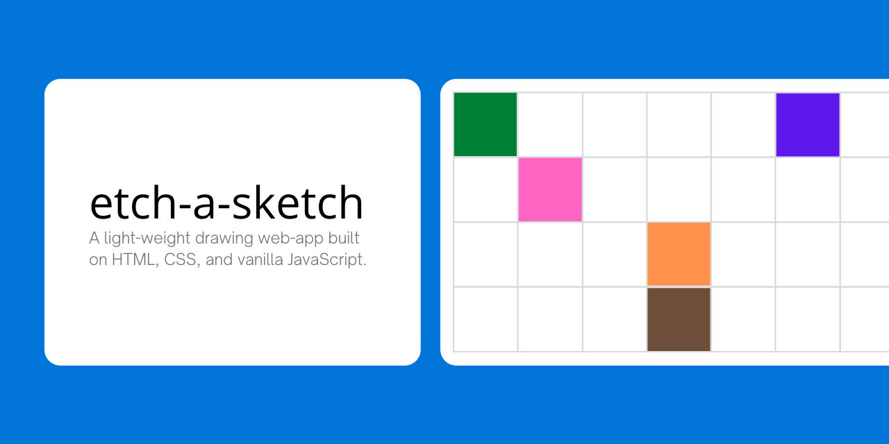

`etch-a-sketch` is a light-weight drawing web-application built on HTML5, CSS, and vanilla JavaScript. It was made in partial completion of The Odin Project curriculum.

## Installation

[A live deployment of the website is available here](https://francislangit.github.io/etch-a-sketch/).

Otherwise, the following steps are for those that would like to run the repository on their local computer.

1. Clone the repository with `git clone https://github.com/FrancisLangit/etch-a-sketch` or download it as a `.zip` file and extract it.
2. Navigate to where the repository is saved on your local machine and open up `index.html` on your preferred web browser.

## Usage

Users will be met with a window wide canvas upon opening up the website. To start drawing, one clicks within the canvas grid to activate it. They then move around their mouse to color each of the squares.

### Color Modes

1. Default - Colors the squares black.
2. Greyscale - Incrementally colors the squares darker. Adds 10% darkness on each pass such that a square becomes black only if it is passed over ten times.
3. Rainbow - Colors each square according to a randomly generated hexadecimal color value.
4. Eraser - Erases each colored square back to white.

### Interface Buttons

- Clear Canvas - Turns all squares within the canvas back to white, should any of them be colored.
- Change Size - Opens up a modal prompting the user for a new canvas size. The user inputs in **one** number between 1 and 32 representative of the height and width of the new canvas.
- Toggle Borders - Turns the grid borders of the canvas on and off.

## Contributing

This repository is currently not open to contribution. However, should  one encounter a bug upon its usage, feel free to submit an issue detailing such.

## License

[MIT License](https://github.com/FrancisLangit/etch-a-sketch/blob/main/LICENSE)

